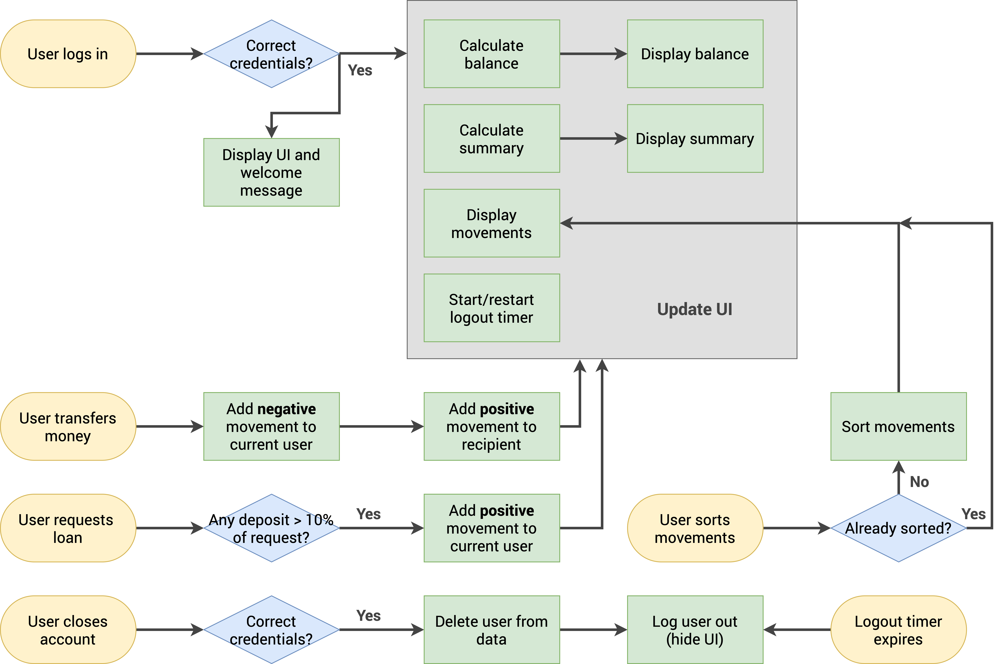

# Introducing BankerApp, the ultimate bank app demo powered by JavaScript that simplifies fund transfers like never before. bakerapp is designed with ease-of-use in mind, allowing users to securely and effortlessly transfer funds between their accounts with just a few taps.

## Key Features:

### User-Friendly Interface:

BakerApp boasts an intuitive and user-friendly interface that ensures a seamless experience for users of all skill levels. The app's clean design and straightforward navigation make it easy to perform fund transfers.

### Secure and Reliable:

Your security is our top priority. BakerApp incorporates industry-standard security protocols to protect your financial data and transactions. Rest assured that your information is safe and your transfers are secure.

### Account Management:

Easily link your accounts and view your balance and transaction history in one place. bankerapp keeps you informed about your financial status at all times.

### Simple Fund Transfers:

With just a few clicks, you can initiate fund transfers between your accounts. Select the source and destination accounts, specify the amount, and bankerapp will handle the rest.

### To Log in use these mock user profiles -->

_owner: 'Shaikh Parwez',
username : SP,
pin: 1111_

---

_owner: 'Jessica David',
username : JD,
pin: 2222_

---

## Working :

